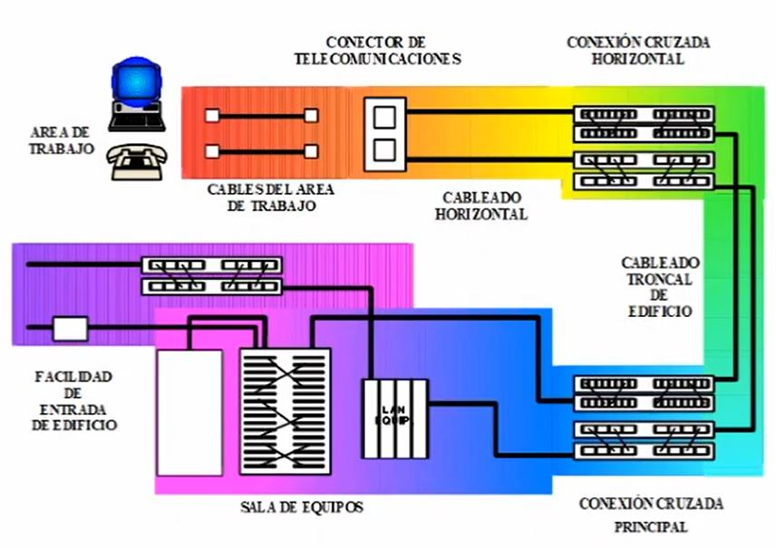

# EIA/TIA-568

## Norma EIA/TIA-568

Se basa en certificar la calidad de los componentes: cables, conectores, clavijas (conectores), etc.; en categorías. Inicialmente estadounidense, esta norma se utilizó globalmente hasta la adaptación de la ISO.

## Estándar EIA/TIA 568

El estándar define un sistema de cableado preplanificado e independiente del hardware y software de comunicaciones que utilice la infraestructura del cableado.

Está compuesto por distintos subsistemas:

- [Área de trabajo (WA)](#Área-de-trabajo-wa)
- [Armario de telecomunicaciones]()
- [Cableado horizontal y vertical]()
- [Sala de equipamiento]()
- [Facilidades de entrada]()

### Tiene Como Objetivo Fundamental

- Definir medios, topología, puntos de terminación y conexión (qué se conecta, donde se conecta).
- Propone un soporte multiproveedor (cualquier tipo de fabricante) y multiprotocolo (cualquier tipo de red).
- Permite realizar el cableado de un edificio sin tener que conocer de antemano que cosas vamos a enchufar.
- Facilita encontrar y administrar fallos.
- Duración: entre 8 y 15 años.

## Estructura de la EIA/TIA-568

El área de trabajo se conecta a través de un cable a una caja de conexión que tiene otro cable que va a un panel de conexión (o punto de conexión) denominado armario de cableado. Este panel de conexión está en el borde de un piso y todas las áreas de trabajo se conectan a ese equipo, hay uno por cada piso que tengamos y uno de ellos es el principal o de mayor jerarquía.

En un edificio, estos cables van desde el puesto de trabajo al panel de conexión intermedio (intermedio porque no es principal) horizontalmente respecto al piso y por tal motivo recibe el nombre de "cableado horizontal". En caso de que tengamos varios pisos, ese panel de conexión tiene que conectarse con otro panel de conexión mediante lo que se denomina "cableado vertical" o "cableado troncal" o "columna vertebral del cableado (backbone en inglés)".

Al panel de conexión "principal" se le conectan los equipos de comunicación, como servidores, central de telefónica, switches, routers y ese lugar se denomina sala de equipos.

Finalmente tenemos la facilidad de entrada que son todos los servicios externos, TELECOM, FIBERTEL, CABLEVISIÓN, CLARO, CENTRAL DE SEGURIDAD, CONEXIÓN CON INCENDIOS (BOMBEROS) etcétera.

### Área de Trabajo (WA)

Tiene como función conectar los equipos del área de trabajo (PC, impresoras, teléfonos, cámaras de video y demás) a un armario de comunicaciones. Es el punto de ingreso de los usuarios al sistema de cableado.

- Comprende desde la placa de pared hasta el equipo del usuario.
- Diseñado para cambios, modificaciones y adiciones rápidas y fáciles.
- Se recomienda una WA por cada 10 metros cuadrados.
- Mínimo dos salidas por cada WS.