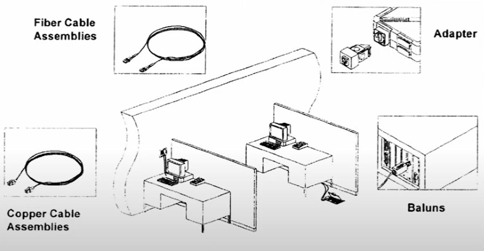

# Área de Trabajo (WA)

Tiene como función conectar los equipos del área de trabajo (PC, impresoras, teléfonos, cámaras de video y demás) a un armario de comunicaciones. Es el punto de ingreso de los usuarios al sistema de cableado.

- Comprende desde la placa de pared hasta el equipo del usuario.
- Diseñado para cambios, modificaciones y adiciones rápidas y fáciles.
- Se recomienda una WA por cada 10 metros cuadrados.
- Mínimo dos salidas por cada WS.

