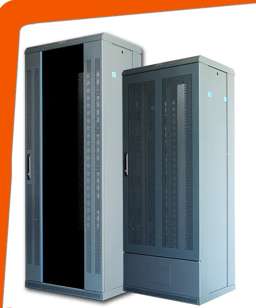

# Armario de Telecomunicaciones

La función del armario es de contener el equipamiento necesario para la conexión de las WA o para la conexión de otros armarios entre sí.

- No existe límite en cuanto a su número.
- Es un concepto (físicamente un área de chapa o puede ser una habitación incluso) donde todos los cableados horizontales terminan. Hay de muchos tamaños, localizaciones, etc.
- Su principal función es la terminación del cableado horizontal.
- Deben ser diseñados de acuerdo con la normativa EIA/TIA 569.
- Tiene que proveerse un ambiente controlado, con temperaturas entre 18 y 24 grados, humedad entre el 30 y 55%, con reguladores de tensión, UPS (sistemas de energía ininterrumpido) entre otros.

?> Lo de la imagen es lo que considera un **Rack**. La sala de telecomunicaciones puede contener 1 o más.
