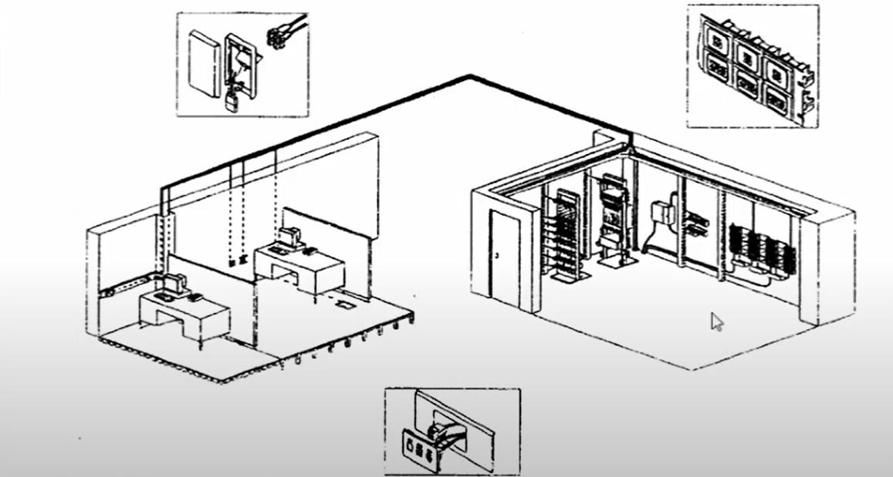
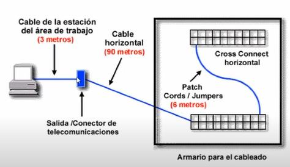

# Cableado Horizontal

Tiene como función conectar los armarios de cableado y/o WA de un piso con el armario de telecomunicaciones del piso.

Es la porción del cableado que va desde cada WA hasta el armario de telecomunicaciones del piso. El término "horizontal" es porque normalmente se emplea porque se desplaza horizontalmente desde el edificio.

!> Hay que tener en cuenta que la distancia máxima del cable en cableado horizontal es de hasta 100 metros: 90m cable horizontal + 3m usuarios + 7m Patch panel.

## Tipos de Cables Utilizados en Cableado Horizontal

- Par trenzado, cuatro pares, sin blindaje (UTP): Este es el utilizado por excelencia, el cable UTP (Unshielded Twisted Pair) de cuatro pares categoría 6 o 6A (mayor inmunidad al ruido y velocidades altas a cortas distancias).
- Par trenzado, cuatro pares, con blindaje (FTP Foiled Twisted Pair).
- Par trenzado, dos pares, con blindaje (STP Shielded Twisted Pair).
- Fibra óptica multi y monomodo.

## Consideraciones a Tener en Cuenta en el Cableado Horizontal

Es fundamental a la hora de establecer la ruta del cableado evitar que el cable pase por los siguientes dispositivos para evitar interferencia electromagnética:
- Motores eléctricos o transformadores.
- Cables de corriente alterna.
- Luces fluorescentes.
- Intercomunicadores.
- Equipo de soldadura.
- Aires acondicionados, ventiladores, calentadores.
- Otras fuentes de interferencia electromagnética o de radio frecuencia (microondas, por ejemplo, ya que parte de sus frecuencias salen y se conectan).