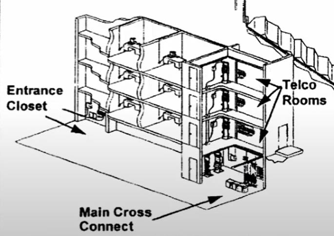

# Cableado Vertical

La función es conectar todos los armarios de telecomunicaciones de cada piso con la sala de telecomunicaciones del edificio. Es el cableado que ocurre entre distintos pisos del edificio y de allí recibe su nombre.

Normalmente es el menos costoso de instalar porque lleva muchos menos cables que el cableado horizontal.

## Distancias Dentro del Edificio:

- Cables de cobre Cat 6 100 metros.
- Cables de fibra óptica 500 metros.

## Cables Utilizados

Hoy en día, todos los edificios utilizan cables de fibra óptica ya que son capaces de mantener altas velocidades a largas distancias (a diferencia del cobre). Pero algunos de los que se utilizaron/utilizan son:
- Multipar UTP.
- UTP Categoría 6.
- Fibra óptica multimodo y monomodo.

También hay cableado vertical entre edificios y el cable utilizado es siempre la fibra óptica ya que la FO es dieléctrica, significa que no genera diferencia de potencial por diferencias de conexión a tierra.
