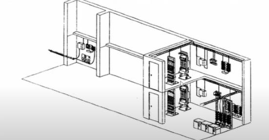

# Facilidades de Entrada

Es el lugar donde ingresan los servicios de telecomunicaciones al edificio y/o donde llegan las canalizaciones de interconexión con otros edificios de la misma corporación. Su función es permitir la conexión del edificio con otros edificios, así como también el acceso de los servicios externos (telefonía, internet, video, datos, etc.)

- Se conectan al backbone a través de la sala de comunicaciones.
- Tienen que seguir los estándares de la ANSI/EIA/TIA-568-A y 569.
- Se deben instalar protecciones de los servicios externos. Por ejemplo, imaginemos que cae un rayo por el cable de teléfono, por lo que se necesita protección térmica y de puesta a tierra; para evitar que se queme el teléfono, internet, etc.
- Ayuda a diagnosticar si un problema se debe al servicio público o al cableado estructurado.
- La norma específica que debería estar afuera de la sala de equipos (aunque se suele poner adentro por comodidad, pero separado del resto).

