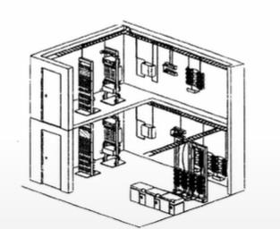
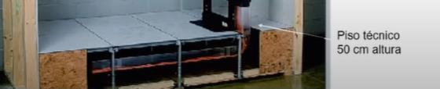

# Sala de Equipamiento

Tiene como función ser el punto central de conexión para todos los armarios de telecomunicaciones. Contiene las conexiones cruzadas principales y la granja de servidores.

Se consideran diferentes a los armarios de telecomunicaciones por su envergadura. Tienen mayor costo, tamaño y/o complejidad del equipo que
contienen.

Contiene las granja de servidores que es un armario que contiene el
equipamiento necesario para conectar los servidores de la sala con todos los
equipos de las WA y otros edificios.

> Los requerimientos de las salas de equipamiento se especifican en los estándares ANSI/EIA/TIA-568-A y 569.

La sala de equipamiento debe contar con un piso técnico a 50 cm de altura como mínimo.

También se especifica que debe estar rodeado de paredes, considerando una distancia entre la pared y los armarios que van dentro de la sala de equipamientos de 0.76 metros para poder abrir la puerta.

