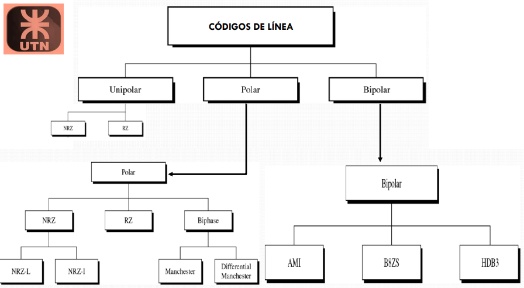
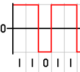
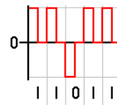

# Clasificación de Códigos de Banda Base

## Según Amplitudes de Tensión

### Unipolar

Son aquellos que manejan un único nivel de tensión, **positivo** $(A, 0)$ o **negativo** $(-
A, 0)$.

### Polar

Son aquellos que manejan dos niveles de tensión, **positivo y negativo** $(-A, A)$. Se usa
un nivel de tensión para un elemento y otro nivel de tensión para el otro.

### Bipolar

Son aquellos que manejan tres niveles de tensión, **positivo, cero y negativo** $(-A, 0, A)$. Al cero se le asigna el valor de tensión cero y al uno se lo alterna entre positivo y negativo.

## Según la Relación del Tiempo del Símbolo con el Tiempo del Bit

### No Retorno a Cero (NRZ)

Son aquellos donde el nivel de tensión se mantiene constante durante la duración del bit. En comunicaciones, se denomina NRZ porque el voltaje no vuelve a cero entre bits consecutivos de valor uno.

### Retorno a Cero (RZ)

Son aquellos donde cada bit retorna a cero en la mitad del tiempo del bit (El tiempo del bit también puede denominarse **intervalo significativo**). Requieren del doble de ancho de banda para transmitir la misma información.

