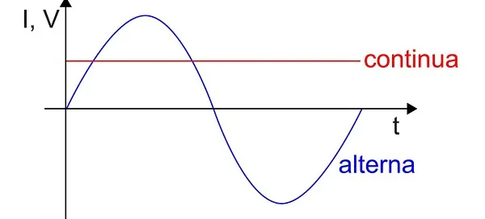

# Introducción

Se busca entender los conceptos tantos físicos y químicos que nos permiten entender los fenómenos que se ponen en juego cuando transmitimos señales a través de los medios físicos de transmisión.

## Algunos Conceptos Básicos

### Diferencia de Potencial

Es cuando se aplica una fuerza eléctrica sobre un conjunto de átomos causando que los electrones que orbitan en la banda de valencia se muevan a la banda de conducción, produciéndose la transmisión de corriente.

### Capacitor

Dispositivo que absorbe energía y la mantiene hasta ser liberada.

## Corriente Eléctrica

La corriente eléctrica es el flujo de electrones entre átomos, donde la carga positiva está concentrada en el núcleo del átomo y luego existen orbitales donde se ubican los electrones. Los electrones más alejados del núcleo son aquellos encargados de conducir la corriente eléctrica y se ubican en la banda de valencia.

Necesitamos aplicar una diferencia de potencial equivalente al salto de energía entre la banda de valencia y la banda de conducción para poder liberar estos electrones de su posición de equilibrio. Esta es la idea básica de la corriente eléctrica.

Por convención, la corriente eléctrica siempre va desde el polo positivo al negativo, aunque en la realidad es al revés.

## Tipos de Corriente Eléctrica

### Corriente Alterna

La corriente alterna es aquella donde la magnitud de la tensión y el sentido de la corriente varían. La forma de oscilación más comúnmente utilizada es la oscilación senoidal, con la que se consigue una transmisión eficiente de la energía.

Es la más fácil de generar y de transportar y por ese motivo es la más habitual y la que usamos en los enchufes de nuestras viviendas.

### Corriente Continua

Es aquella que genera una tensión constante que no varía en el tiempo y siempre se mueve en el mismo sentido, de polo positivo a negativo. Prácticamente todos los equipos electrónicos, como un ordenador, aunque se conecten a corriente alterna, utilizan corriente continua. Lo que hacen es convertir la corriente alterna del enchufe en corriente continua por medio de una fuente de alimentación que llevan en su interior.

## Medios físicos de transmisión

### Guiado

Son aquellos que guían las ondas a través de un camino físico, como pueden ser los cables, fibras ópticas y guías de onda. Transportan energía en forma de corrientes eléctricas o luz.

### No Guiado

Son los que no están cerrados en ningún medio físico, sino que se transmiten por el
aire o el vacío. Transportan energía en forma de ondas electromagnéticas.

## Atenuación

La atenuación es la pérdida de la potencia (o amplitud que es lo mismo) de una señal tanto para medios físicos guiados o no guiados.

## Impedancia

## Decibel

## Efecto Skin