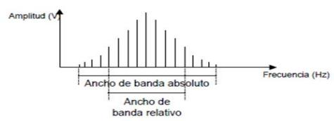
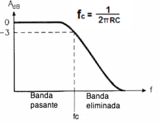
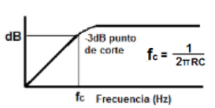
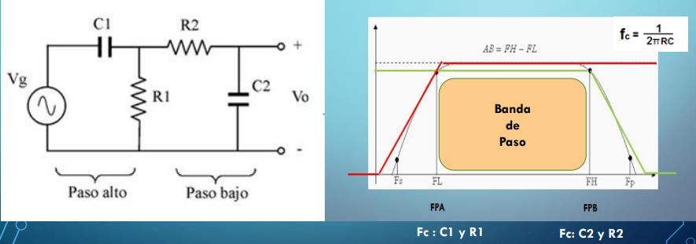
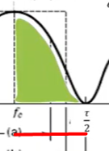
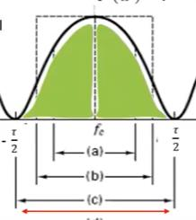
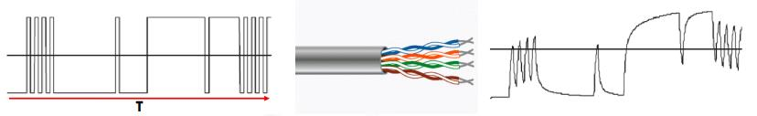
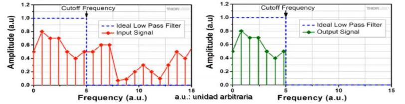

# Ancho de banda

El ancho de banda es el rango de frecuencias significativas de la señal que un
medio físico de transmisión debe transmitir. Normalmente el ancho de banda se calcula como la diferencia entre la mayor y menor frecuencia de una señal (periódica o no periódica). $$B = \text{frecuencia superior} - \text{frecuencia inferior}$$

Existen "dos" tipos de ancho de banda:

- **Ancho de banda absoluto [Hz]:**
Es el ancho del espectro de frecuencias completo. **Es infinito** ya que se toman todas las armónicas.

- **Ancho de banda relativo [Hz]:**
Es el ancho del espectro de frecuencias donde se **concentra la mayor parte de la energía** de la señal. Normalmente **es finito** ya que se toman algunas armónicas en función del uso que se le dará a la señal.

    

?>  En transmisiones reales, usamos **el ancho de banda relativo** y no el absoluto, ya que para que una señal pueda ser transmitida por un canal de comunicación, el espectro de frecuencia de esta tiene que entrar en el canal y, en una señal aperiódica, vimos que, en la teoría, su ancho de banda es infinito (y esto no puede entrar en un canal real). Es por eso que a partir de ahora, cuando hablamos de ancho de banda, nos estaremos referiendo al ancho de banda relativa, ya que es con el que trabajaremos.

# Filtros

Los filtros nos permiten delimitar que frecuencias (o ancho de banda) nos interesa transmitir o recibir.

Para estos, se suele usar un concepto llamado **Frecuencia de Corte**. Es un valor de referencia que se toma para determinar, cuando hay una caída/subida de la potencia de una señal. Este cambio no suele ser instantaneo, sino que progresivo.

?> El valor que se toma de referencia para la Frecuencia de Corte es de 70.7% (ya sea, caida o subida) de su valor máximo, esto ocurre cuando la reactancia capacitiva iguala a la resistencia.

## Filtro Pasa Bajo

Son aquellos que dejan pasar señales de baja frecuencia a partir de la frecuencia de corte.

## Filtro Pasa Alto

Son aquellos que dejan pasar señales de alta frecuencia a partir de la frecuencia de corte.

## Filtro Pasa Banda

Son aquellos que dejan pasar señales de frecuencia comprendidas dentro de dos frecuencias límites $AB = FH - FL$. Es una unión entre un filtro pasa bajo y un filtro pasa alto.

# ¿Cómo buscar la mayor cantidad de energía en las señales?

En el ancho de banda relativo nosotros hacemos una consideración de en donde se encuentra la mayor cantidad de energía de la señal. Para esto existen diversos criterios.

## Primer Nulo

Este ancho de banda relativo va entre la frecuencia cero y el primer corte en cero de la función sinc.

## Nulo a Nulo

Va entre el primer nulo en el rango negativo al primer nulo en el en rango positivo. Hay otros, pero esos dos son los más importantes. El más comúnmente usado es el primer nulo.

# Problema a la Hora de Transmitir Datos por una Línea de Transmisión Alámbrica

Las señales que nos interesan en las comunicaciones son las **no periódicas**, ya que son **con las que transmitimos datos**. Estas señales, como ya vimos, poseen normalmente un ancho de banda infinito.

También sabemos que los medios físicos de transmisión tienen un ancho de banda máximo, es decir, permiten pasar hasta ciertas frecuencias. Como vimos, a medida que la frecuencia una señal aumenta, sucede el **[efecto skin](../intr_sistemas_de_comunicaciones/fisica_de_las_comunicaciones#efecto-skin)** y si continúa aumentando el conductor se transforma en una antena y las cargas comienzan a ser irradiadas.

Supongamos que tenemos una señal de pulsos cuadrados y la queremos transmitir por una línea de transmisión alámbrica como lo puede ser un cable UTP, vamos a poder ver que la señal se deforma al transmitirla.

Esto es debido a que el cable actúa como un **[filtro pasa bajo](#filtro-pasa-bajo)** y recorta todo el rango de altas frecuencias que al fin y al cabo contiene parte de la energía de la señal y esto causa que los pulsos se modifiquen.

Para que la señal sea exactamente igual, el ancho de banda tendría que ser infinito y esto no es posible.