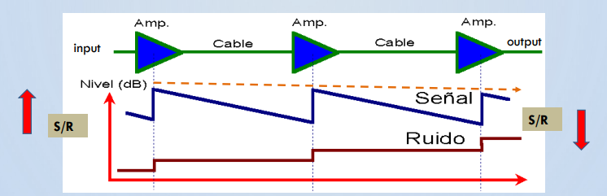

# Capacidad de Canal

# Eficiencia Espectral

# Ruido

En las comunicaciones, se refieren a señales no deseadas que se mezclan con la señal que se busca transmitir originalmente.

## Ruido en un Sistema de Transmisión o Comunicación Analógico

Un sistema de transmisión analógico es aquel en donde la energía o información se transmite y recibe en forma analógica. Las señales entonces, a diferencia de la transmisión digital que pasa de un valor a otro, pasa por todos los valores intermedios, es continua y toma infinitos valores. Un ejemplo de estas señales son la luz, sonido, entre otros.

Para poder mantener relativamente constante la potencia de una señal, siempre que se pierde potencia, esta se puede amplificar utilizando amplificadores. Sin embargo, **cada vez que se amplifica la señal, se incorpora mayor ruido**. A largas distancias, la señal tendrá que ser amplificada varias veces ya que gradualmente va perdiendo potencia y esto causará un mayor ruido.

Esto solo sucede en señales analógicas. Las señales digitales no utilizan amplificadores, sino que usan **repetidores** que lo que hacen es recibir la señal, filtrarla (reconocerla), regenerarla y después retransmitirla perfecto.

Podemos notar en el gráfico que, **la relación señal ruido $(S/R)$ disminuye a medida que empeora y aumenta a medida que mejora**.