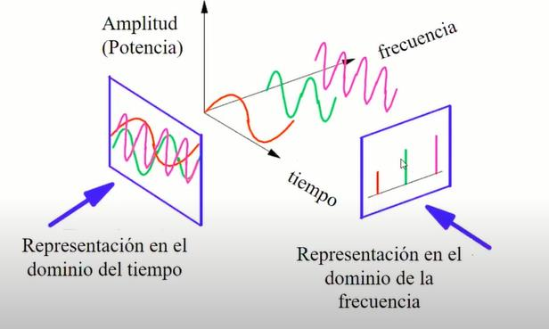
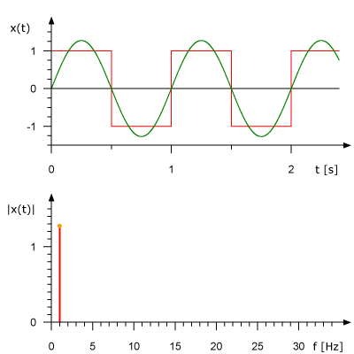

# Fourier

Una señal, puede ser representada en el **dominio del tiempo** o en el **dominio de la frecuencia**. De esta forma, podemos tomar una señal y ver como varía su amplitud (tensión o voltaje) en función del tiempo.

Sin embargo, una señal también **puede estar constituida por la suma de componentes** (otras señales) de distintas frecuencias. Entonces si en otro plano nosotros vemos como varía la amplitud en función de la frecuencia, veremos el espectro de las distintas frecuencias que componen a $f(t)$.

Para poder encontrar el espectro de frecuencia de una señal periódica, debemos utilizar el análisis de Fourier.

### Espectro de Frecuencias

Se refiere al conjunto de frecuencias que constituyen una señal.

# Análisis de Fourier

Fourier demostró que, podemos **construir cualquier función periódica $f(t)$ con período $T$ sumando una cantidad (infinita) de senos y cosenos**. El análisis de Fourier entonces nos permitirá descomponer una señal que originalmente estaba en el dominio del tiempo $f(t)$ en las distintas componentes de frecuencia que la componen y dándonos como información a qué frecuencia se encuentra cada una y qué amplitud o energía de tensión o potencia tienen para poder representarlas en el dominio de la frecuencia $f(w)$.

De esa forma podés analizar la señal en sus valores de potencia o de tensión que es lo que nos interesa para saber qué señales ingresar como entrada para lograr ciertos valores de salida teniendo en cuenta los fenómenos físicos que suceden.

## Armonicas

Una función periódica $f(t)$ se puede escribir como la suma de componentes sinusoidales de distintas frecuencias $n * w0$. Cada componente sinusoidal representa una **armónica** enésima de la función. Por ejemplo, la decimosegunda componente sinusoidal, será la decimosegunda armónica de la función.

La frecuencia fundamental, calculada como $w0 = 2\pi f_0 = 2 \frac{\pi}{𝑇}$ es aquella frecuencia que corresponda con la frecuencia de la señal periódica $f = \frac{1}{t}$ que buscamos representar.

Aquella componente o armónica cuya frecuencia coincida con la fundamental ($n=1$) se denominará **componente fundamental**.

## Componente continua

A la componente de frecuencia cero $a_0$ se le llama componente de continua $CD$ y **corresponde al valor promedio de $f(t)$ en cada período**.