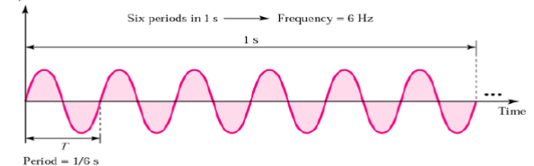

# Introducción

**Una señal** se define como cualquier magnitud que podamos medir de alguna forma y que contiene algún tipo de información sobre el comportamiento o naturaleza de algún fenómeno. En comunicaciones, específicamente, nos interesan **las señales eléctricas**, estas describen algún fenómeno físico mediante una cantidad eléctrica, como puede ser un voltaje o corriente, que tenga alguna característica que varíe en el tiempo, como son sus tres parámetros: **frecuencia**, **amplitud** o **fase**; de forma que lo haga impredecible.

Para la existencia de información, debe haber incertidumbre. Por ejemplo, una corriente continua, periódica, que no varíe en el tiempo, no tiene incertidumbre; por lo que podemos predecir su comportamiento en cualquier momento del tiempo y por lo tanto no nos brinda información. En cambio, una corriente alterna, no periódica, si posee incertidumbre en su comportamiento en el tiempo y por lo tanto si nos brinda información.

?> Se dará más enfásis sobre este tema de información en la sección [Teoría de la información](teoria_de_la_informacion)

## Variaciones en las Señales

### Periódica o no Periódica

Una señal es periódica si esta se repite exactamente después de un intervalo de tiempo fijo. La duración en el tiempo de este ciclo completo de la señal se define como el período de $f(t)$ denominado $T$

Una señal es no periódica si esta no cumple con la condición de arriba.

### Aleatoria o Determinista

Una señal es determinista si no existe incertidumbre con respecto a su valor en cualquier instante de tiempo (y por lo tanto se puede determinar o predecir su valor).

Será aleatoria si existe algún grado de incertidumbre cualquiera en los valores de la señal.

Las señales deterministas normalmente se escriben de la forma $f(t) =$; mientras que las
aleatorias no permiten tal expresión.

### De energía o de Potencia

Una señal de energía (como por ejemplo las señales deterministas o no periódicas) son aquellas que tiene una energía distinta de cero pero finita para todo tiempo, tienen una potencia media nula. Una señal de energía es entonces aquella que existe sólo durante un intervalo finito de tiempo y toda su energía se concentra en ese intervalo.

Una señal de potencia (como por ejemplo las señales periódicas o aleatorias) son aquellas que tienen una potencia media distinta de cero, pero finita para todo el intervalo de tiempo desde menos a más infinito. Una señal de potencia es una señal de energía, pero se la define para poder diferenciar señales que son infinitas.

### Analógica o Digital

Una señal analógica o continua es aquella que tiene una variación continua de su amplitud en el tiempo. Por ejemplo, una señal sinusoidal o cosenoidal.

Una señal digital o discreta es aquella que solo existe a tiempos discretos, es decir, tiene una variación discreta de su amplitud en el tiempo. Por ejemplo, una función que solo pueda tomar dos valores o muchos, pero no infinitos, como un pulso.

## Frecuencia y Periodo

La **frecuencia** es la medida del número de veces que se repite un fenómeno por unidad de tiempo.

El **período** $T (seg)$ es la duración de tiempo de cada evento repetitivo y es por esto que, en señales periódicas, la **frecuencia se puede calcular también como la inversa del período**: $\frac{1}{T}[\frac{1}{Seg}]$.

La anterior señal se repite un total de 6 veces en un segundo, por lo que su frecuencia es $6 Hz$. El período, que es la inversa de la frecuencia, resulta entonces $\frac{1}{6}$ segundos.