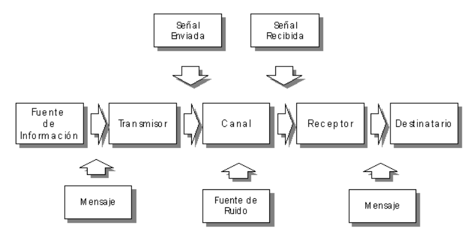

# Teoría de la Información

La teoría de la información es una rama de la teoría de la probabilidad que se ocupa de la medición de la información, cómo representar la información y también la capacidad de los sistemas de comunicación de transmitir y procesar información.

Tiene como objetivo estudiar las señales y el contenido de información que poseen.

